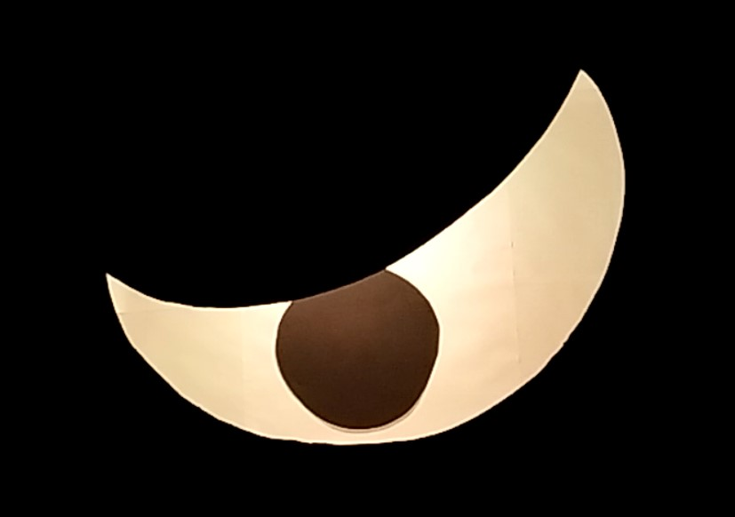
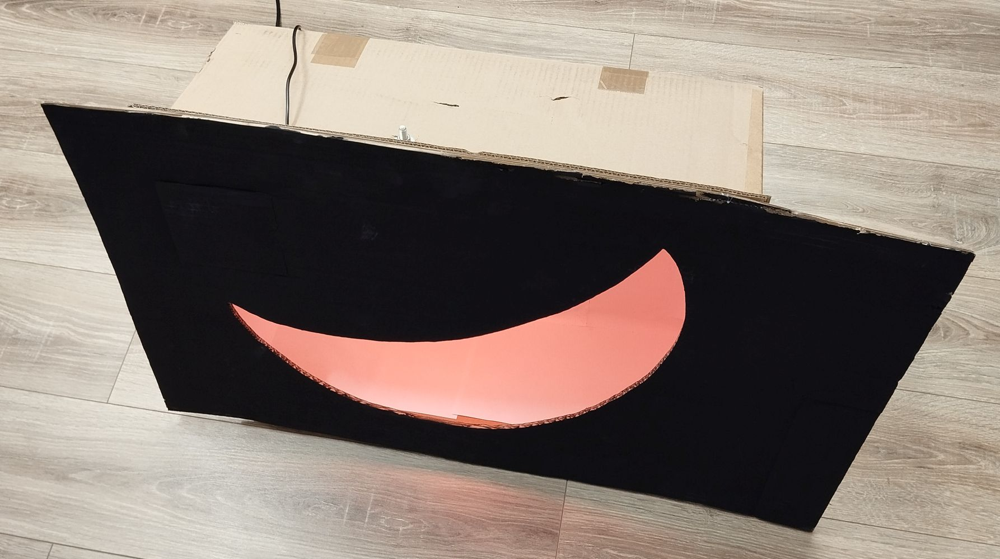
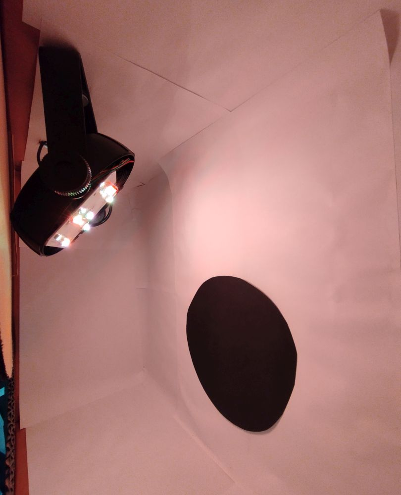

# spooky eyes halloween decoration

I've got two narrow windows looking towards the street and they seem perfect for a spooky eyes halloween decoration.
Each window will get one eye like this:

When moving by, this is the effect created:

## construction

It is made a cardboard box, glued to a front plate. 
The front plate is also cardboard (the size of the window), painted black on the front.
The cutout is in the shape of an eye (with matching left and right sides).
This plate will be taped to the window from the inside of the window (yay! easy to install in advance and weaterproof).

The white part of the eye is a cardboard box in the style of an integratings sphere.
I spared the effort of painting it, but glued sheets of white paper to the inside, which nicely hides the cardboard flaps.
The white papers seems plenty reflective and can only be noticed up close.
The pupil is a black piece of paper glued to the back. 
For now, I used painters tape to adjust the position later on.

The inside is mostly white from the paper and illuminated by a modified spot for each eye.
The spot is hidden behind the "eye lid".
By removing the lenses from the LED spot, it gives a nicely uniform illumination. 
In reality, it looks much more uniform than on camera.

## what is special about it?

The pupil is not in the same plane as the cutout, but set to the back by about 22cm.
With the parallax effect, the position of the pupil moves relative to the cutout, with the gaze seeming to follow you.

